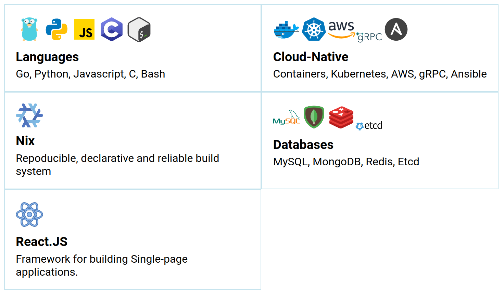

> Architecting resilient systems for uninterrupted digital experiences.

In the rapidly evolving world of technology, my focus lies predominantly
on Cloud-Native technologies, which have become a cornerstone of modern
computing. However, I also find myself venturing into the realm of
security, exploring its intricacies whenever the need arises. I am
currently pursuing a bachelor's degree in technology

Should you require any assistance or have work-related or services
inquiries, please do not hesitate to reach out to me via [E-Mail -
murtaza@murtazau.xyz](mailto:murtazau.xyz).

* [Website](https://murtazau.xyz)
* [E-Mail](mailto:murtaza@murtazau.xyz)
* [Twitter](https://twitter.com/murtaza_u_)
* [Mastodon](https://hachyderm.io/@murtaza)
* [LinkedIn](https://www.linkedin.com/in/murtaza-u/)

